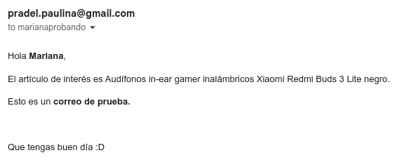

# py-correo-automatizado

Aplicación simple para obtener un archivo remoto por medio de la API de Google Drive, para 
después importarlo y leerlo como un dataframe de pandas. Los datos de dicho dataframe armarán _N_ cantidad de 
mensajes de correo electrónico y se enviarán usando la API de Gmail.

## Acerca de este proyecto

Como buena persona programadora, a veces me gusta complicarme la vida y pasar muchas horas automatizando una tarea que 
probablemente me tome dos horas hacerla de un jalón :3. Y pues bien, en el lugar donde trabajo tuvimos la iniciativa de 
realizar un intercambio virtual navideño. Soy la encargada de crear un formulario para que las personas registren sus 
preferencias de regalo y sus datos de contacto. Después también debo de enviar _N_ cantidad de mails para informar a 
cada persona los resultados del sorteo, direcciones, etc. Así que aprovechando que los resultados del formulario de 
Google arrojan un spreadsheets de datos, se me ocurrió construir esta aplicación aprovechando las bondades (o no) de las 
API de google.

Seguramente existe una manera más fácil de hacer esto y evitar la programación, pero de cualquier manera **este es un 
excelente ejercicio para aprender más y mejor acerca de las API de gugul y para seguir practicando python**.

Gracias si llegaste hasta aquí y espero que esta aplicación te sirva o al menos la encuentres curiosa.

### Las API's de Google

Trabajar con las API de Google con Python no es tan directo como uno pensaría. Existen
[ciertos wrappers](https://github.com/googlearchive/PyDrive) de algunas de ellas que hacen el trabajo más sencillo y
que funcionan bastante bien, pero siempre es bonito ensuciarnos un poco las manos para aprender mucho más. Si te
interesa agregar funcionalidades a este código para adaptarlo a tus necesidades, tendrás que ensuciarte las manos. 
Para hacer tu vida más sencilla pondré acá algunos enlaces útiles que me sirvieron bastante
para poder construir esta aplicación y para que puedas pasar a la sección de _Instalación e Instrucciones_ mejor 
informade.

Dentro de la documentación de la API de Google Drive se encuentra este
[ejercicio de codelab](http://g.co/codelabs/gsuite-apis-intro) con Python que te enseñará entre otras cosas a obtener
las credenciales para tu aplicación, crear un proyecto en la consola de desarrolladores de Google, aprender acerca de
las [bibliotecas cliente de la API de Google](https://developers.google.com/api-client-library/), entre otra cosas.

#### Los `scopes`

Dependiendo de lo que necesites trabajar u obtener de las diferentes API de Google es a como vas a configurar unas 
variables llamas `scopes`. En este proyecto existe un archivo llamado `autenticacion.py` que tendrás que ejecutar la 
primera vez que uses este código para que le des permiso a tu cuenta de Google de acceder a este proyecto (aplicación 
web). En ese archivo modificarás los `scopes`. Para este proyecto lucen así:

```python
scopes = 'https://www.googleapis.com/auth/drive.readonly.metadata https://www.googleapis.com/auth/drive.readonly https://www.googleapis.com/auth/gmail.compose'
```

En el primer scope, estamos pidiendo permiso para ver los metadatos de los archivos que se encuentran en Google Drive,
en el segundo scope estamos pidiendo permiso para leer el contenido de los archivos que se encuentran en Google Drive, y 
en el tercer scope estamos pidiendo permiso para crear y enviar mensajes usando Gmail.

Los `scopes` completos de la API de Google Drive los puedes encontrar 
[aquí](https://developers.google.com/drive/api/guides/api-specific-auth) y los de la API de Gmail
[acá](https://developers.google.com/gmail/api/auth/scopes).

Puedes agregar la cantidad de `scopes` que necesites a la variable; sin embargo, es necesario tener cuidado pues estás 
dando potencial acceso de datos sensibles a una aplicación externa. Te recomiendo que verifiques muy bien en la 
documentación el tipo de uso (Recomendado, Sensible y Restringido) que tiene cada `scope`.

Cabe mencionar que los `scopes` usados aquí están marcados con `Restringido`, por lo que la primera vez que se
abra la ventana en tu navegador para dar permiso a la aplicación te aparecerá una advertencia de que esta aún no está
verificada. Esto es porque Google requiere que se lleve a cabo un proceso de verificación cuando las aplicaciones web
tienen acceso a ciertos datos sensibles para el usuario. Dado que tú como persona usuaria estás construyendo tu propia 
aplicación web en la consola de Google y a este código le estás dando acceso a tu cuenta de Google, no debería de 
haber ningún problema. Bajo ninguna circunstancia al correr esta aplicación yo como autora del código tendré acceso a 
tus datos. Es posible que en un futuro someta esta aplicación web a verificación, simplemente por trámite administrativo 
y para que ya no aparezca la ventana de advertencia. Para aprender más acerca de la verificación de las aplicaciones 
web externas, puedes ir a [este enlace](https://support.google.com/cloud/answer/10311615#verification-status).

#### Los _MIME Type_

Un [MIME Type](https://developer.mozilla.org/en-US/docs/Web/HTTP/Basics_of_HTTP/MIME_types) es un estándar que define 
el tipo y formato de un archivo. Para poder descargar un archivo almacenado en Google Drive usando su API es necesario
conocer su _MIME Type_. Esto es debido a que dependiendo de si un archivo pertenece al _Google Workspace_ (Google Docs, 
Google Sheets, etc.) o tiene otro formato (pdf, csv, etc.) se utilizará un método u otro de la API para 
[descargar o exportar](https://developers.google.com/drive/api/guides/manage-downloads) 
el contenido del archivo por medio de la misma. Dentro del método empleado será necesario especificar el 
_MIME Type_ con el cual se descargará o exportará el archivo. Por ejemplo, en el caso de que quiera descargar el 
contenido de un Google Sheet, usaré el método 
[`export_media()`](https://developers.google.com/drive/api/v3/reference/files/export) y especificaré en sus parámetros 
que deseo exportarlo como un archivo de Microsoft Excel con extensión `.xlsx`, por medio del 
_MIME Type_ `application/vnd.openxmlformats-officedocument.spreadsheetml.sheet`.

En la documentación de la API de Google Drive se listan los _MIME Type_ soportados de acuerdo a si pertenecen al
_Google Workspace_ o no:

- [_Google Workspace_ MIME Type](https://developers.google.com/drive/api/guides/ref-export-formats) 
    (Google Docs, Google Sheets, etc.)
- [MIME Type de otros formatos que soporta Google Drive](https://developers.google.com/drive/api/guides/mime-types) 
(.xlsx, .csv, .doc, .pdf, etc.)

En el script `guguldraiv.py` de la carpeta `servicios` de este proyecto es posible modificar o agregar los
_MIME Type_ con los que se exportan o descargan los archivos. Dado que una de las funciones de este 
proyecto es tener un listado de datos para con ello construir _N_ correos electrónicos, los archivos más comunes que 
acepta la aplicación son aquellos con extensión `.xlsx`, `.csv`, o un Google Sheet. En caso de que el tipo de archivo 
sea distinto, la aplicación te mandará un mensaje de error para que modifiques el nombre del archivo, esto es 
referido en el paso _10_ de la sección de **_Instalación e Instrucciones_**.

## Requerimientos

Por medio del archivo `Pipfile` o el `requirements.txt` es posible instalar las dependencias de este proyecto. Para 
usar el `Pipfile` es necesario tener instalado [Pipenv](https://pipenv.pypa.io/en/latest/) y crear un ambiente 
virtual como se indique en la documentación. El archivo `requirements.txt` se puede utilizar con cualquier otra 
herramienta para generar ambientes virtuales de Python. Es muy recomendable trabajar dentro de un ambiente 
virtual para el uso de este proyecto y evitar la instalación de los requerimientos de manera global. 

En este proyecto se usa `Python 3.10` y sus dependencias principales se listan a continuación:

- [Pandas](https://pandas.pydata.org/)
- [Biblioteca cliente de la API de Google](https://github.com/googleapis/google-api-python-client)
- [Openpyxl](https://openpyxl.readthedocs.io/en/stable/)

Para familiarizarse con el uso de las API de Google usando Python, se puede realizar este 
[ejercicio de codelab en google](http://g.co/codelabs/gsuite-apis-intro).

## Instalación e instrucciones

### Inicio
1. [Clona](https://git-scm.com/docs/git-clone) este repositorio en tu computadora.
2. Instala las dependencias según lo recomendado en la sección anterior.

### Configurar la API de Google drive por primera vez

Lo descrito en esta sección solo es necesario efectuarlo una sola vez para dar permisos a la aplicación.

3. [Crea un proyecto](https://developers.google.com/workspace/guides/create-project) en la consola de 
desarrolladores de Google y dale un nombre.
4. [Habilita las API](https://developers.google.com/workspace/guides/enable-apis) de Google necesarias. En este 
proyecto se necesitan las API de Google Drive y de Gmail.
5. [Autoriza el uso de tu aplicación, crea las credenciales](https://console.cloud.google.com/apis/credentials) 
para tu proyecto.
6. Baja de la consola de tu proyecto el archivo `.JSON` que contiene las credenciales y colócalo en la carpeta
`/credenciales`. Le puedes dar el nombre que tú quieras, pero por default aquí este archivo 
se llama `credenciales.json`. Si deseas cambiarle el nombre, puedes ir a `autenticacion.py` y modificar la variable 
`archivo_credenciales`.
7. Crea en la carpeta `/credenciales` un archivo de nombre `storage.json`. En este archivo se guardará el token de
acceso una vez que autorices el uso de la aplicación web. Este archivo junto con el `credenciales.json` y toda 
la carpeta `/credenciales` están marcados en el `.gitignore` para no ser cargados al repositorio de github. Cada vez 
que agregues o modifiques los `scopes` en el archivo `autenticacion.py` es necesario que borres el archivo 
`storage.json` y vuelvas a correr la autenticación.
8. Corre el archivo `autenticacion.py`, haciendo `python autenticacion.py`. Se abrirá una ventana en tu navegador que 
mostrará una advertencia (ir a la sección de `scopes` más arriba para conocer más) o bien te pedirá que des permiso 
con tu cuenta de Google a los `scopes` utilizados. El script `autenticacion.py` es una adaptación del código mostrado en 
este [Google codelab](http://g.co/codelabs/gsuite-apis-intro).
9. Si todo salió correctamente en la misma ventana de tu navegador aparecerá un mensaje que indicará que la 
autenticación fue exitosa. También en tu consola aparecerá una lista de los primeros 10 archivos que se encuentran en 
tu Google Drive (creados, abiertos, o compartidos por y hacia ti).


### Establecer las variables que componen el correo

10. En el script `aplicacion.py` establece la variable `nombre`, colocando el nombre del archivo 
almacenado en Google Drive y en donde se encuentran los datos que van a componer el cuerpo de los correos electrónicos 
que deseas mandar. Esta variable es una cadena de texto. Por default en este script `nombre = ''`, es decir una 
cadena de texto vacía. Si no cambias la variable te aparecerá un mensaje de advertencia para que lo modifiques.
Los tipos de archivo que acepta esta aplicación son:

    - Coma Separated Value (csv)
    - Hoja de cálculo de Microsoft Excel (xlsx)
    - Hoja de cálculo en formato abierto (puede que no todos los formatos funcionen)
    - Spreadsheet de Google Sheets

    En el caso de los primeros tres tipos el nombre del archivo lo debes ingresar incluyendo la extensión del mismo, es 
decir `ejemplo_archivo.csv` o bien `ejemplo_archivo.xlsx`. Para los Google Sheets solo ingresa el nombre del 
archivo, es decir `ejemplo_archivo`. Para conocer más acerca de como modificar los tipos de archivo que puede aceptar 
esta aplicación ve a la sub sección **Los MIME Type** de esta documentación.
11. En caso de que el archivo a descargar sea un Microsoft Excel (u otro formato abierto de hoja de cálculo), o bien 
se descargue un Google Sheet exportado con extensión `.xlsx` es necesario que establezcas el nombre de la variable
`hoja` en el script `aplicacion.py` que indicará el nombre de la hoja del archivo descargado. Si no lo estableces
quedará como `None`.
12. Del archivo descargado con el que trabajarás deberás establecer el nombre de la columna que contiene los correos 
de las personas destinatarias, esto lo debes de cambiar en la variable `correo_destinatario` del script `aplicacion.py`.
13. Para componer los correos a enviar necesitas indicar una lista en la variable `composicion_correo` del script
`aplicacion.py`. Esa lista contendrá el nombre de las columnas de tu archivo descargado y que conformarán los correos
que enviarás de manera automática.

### Componer el correo

En el script `yimail.py` de la carpeta `servicios` podrás modificar y componer tu correo electrónico.

14. La variable `cuerpo_msj` está estructurada como un html, modifícala a tu conveniencia para construir tu correo y
usa las variables que estableciste en el paso _13_ para poderlo modificar de acuerdo al contenido de los datos del 
archivo que descargaste de Google Drive.

La aplicación viene con un archivo de datos simulados llamado `dummy.csv` en la carpeta `datos`. Cuando no estableces
la variable `nombre` en el paso _10_ la aplicación utilizará este archivo para mandar correos simulados con direcciones 
de correo que no existen (te llegarán correos automatizados de que no fueron entregados). Esto te puede servir para 
probar si las API están funcionando correctamente. Cuando tú cambias la variable `nombre` automáticamente la aplicación 
tomará los datos del archivo que estés descargando de Google Drive.

Esta es una muestra de uno de los correos que se envían con datos simulados de `dummy.csv`



### Ejecutar la aplicacion para mandar _N_ mails

15. Ahora solo resta que ejecutes la aplicación escribiendo `python aplicacion.py`. En la terminal podrás ver el
progreso de la aplicación y si el envío de los correos fue exitoso.
    
# Contacto y contribuciones

Este proyecto está licenciado bajo [Apache 2.0](http://www.apache.org/licenses/LICENSE-2.0) por lo que eres libre de 
contribuir a este software de manera libre mediante 
[bifurfación y solicitud de incorporación de cambios](https://docs.github.com/es/get-started/quickstart/contributing-to-projects).

Si tienes dudas o simplemente quieres cotorrear me puedes contactar acá:

- Paulina Pradel (pradel.paulina@gmail.com)
